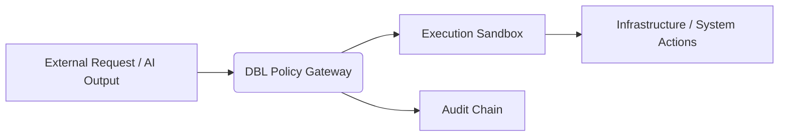

# Architecture – Deterministic Boundary Layer

## 1. Structural View

The DBL sits between three domains:

- **External stimuli (non-deterministic)**: user input, models, agents  
- **Deterministic control plane**: policies, identity, logging  
- **Operational systems (deterministic)**: infrastructure, data, workflows

### 1.1 High-level flow



### 1.2 DBL internal components

```mermaid
graph LR
    %% Styling
    classDef entry fill:#1e1e2a,stroke:#a64dff,stroke-width:2px,color:#ffffff;
    classDef dbl fill:#08161a,stroke:#00ffcc,stroke-width:3px,color:#00ffcc,stroke-dasharray: 5 5;
    classDef system fill:#20252b,stroke:#ffffff,stroke-width:2px,color:#ffffff;
    classDef log fill:#181800,stroke:#ffcc00,stroke-width:2px,color:#ffcc00;

    %% Nodes
    User[Users & Applications]:::entry

    subgraph DBL [Deterministic Boundary Layer (DBL)]
        direction TB
        Policy[Policy Mediation]:::dbl
        Exec[Execution Governance]:::dbl
        Context[Context Isolation]:::dbl
        Sign[Signed Audit Chain]:::dbl
        Repro[Reproducibility Envelope]:::dbl
    end

    Systems[Productive Systems\n(Mail, Tickets, ERP, DWH, Identities)]:::system
    Audit[Immutable Audit Log]:::log

    %% Connections
    User -->|Intent / Request| Policy
    Policy --> Exec
    Exec --> Context
    Context --> Sign
    Sign --> Repro
    Repro -->|Controlled Actions| Systems

    Policy -.->|Policy Events| Audit
    Sign -.->|Evidence| Audit
    Repro -.->|Replay / Forensics| Audit

    %% Link styles
    linkStyle 0 stroke:#a64dff,stroke-width:2px;
    linkStyle 5 stroke:#ffffff,stroke-width:2px;
    linkStyle 6,7,8 stroke:#ffcc00,stroke-width:1px,stroke-dasharray: 3 3;
```
