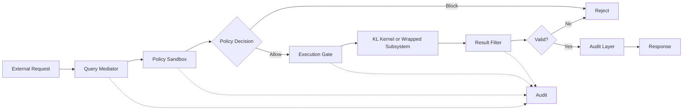

# Architecture

## Overview

DBL is a deterministic boundary between nondeterministic sources and deterministic infrastructure.

It consists of five cooperating components that mediate, govern, execute, validate, and audit all boundary transitions.

---

## Component Model

```
External Request (nondeterministic)
    ↓
[1. Query Mediator]  ← normalize, validate, bind context
    ↓
[2. Policy Sandbox]  ← evaluate policies, enforce boundaries
    ↓
[3. Execution Gate]  ← execute via KL Kernel or wrapped subsystem
    ↓
[4. Result Filter]   ← validate output, apply safety filters
    ↓
[5. Audit Layer]     ← record immutable trace
    ↓
Response (deterministic)
```

---

## 1. Query Mediator

**Responsibility:** Normalize and prepare inbound requests for policy evaluation.

**Functions:**
- Input schema validation
- Request classification and routing
- Identity binding (user_id, tenant_id)
- Context construction (request_id, correlation_id)
- Safety pre-filters (injection detection, size limits)

**Output:** Normalized request envelope ready for policy evaluation.

---

## 2. Policy Sandbox

**Responsibility:** Evaluate request against policies and enforce boundaries.

**Functions:**
- Policy lookup and evaluation (deterministic rule engine)
- Permission checks (RBAC, ABAC)
- Rate limiting and quota enforcement
- Temporal constraints (time windows, cooldowns)
- Context consistency validation

**Output:** PolicyDecision (allow/block + reason). If blocked, execution stops.

---

## 3. Execution Gate

**Responsibility:** Execute request via deterministic substrate or wrapped nondeterministic subsystem.

**Execution Paths:**

**Path A: Deterministic (via KL Kernel Logic)**
- Construct PsiDefinition from request
- Invoke CAEL.execute() or Kernel.execute()
- Capture ExecutionTrace with full timing and policy metadata

**Path B: Nondeterministic (via wrapped subsystem)**
- Invoke external AI model or service
- Capture request/response envelope
- Record timing, model version, and opaque correlation_id

**Output:** Execution result + trace metadata.

---

## 4. Result Filter

**Responsibility:** Validate and sanitize outputs before they reach operational systems.

**Functions:**
- Output schema validation
- Safety filters (secrets, PII, injections)
- Policy compliance checks (content policies, data classification)
- Consistency validation (against prior state or request)
- Provenance and signature requirements

**Output:** Validated result or rejection with reason.

---

## 5. Audit Layer

**Responsibility:** Record all boundary events in an immutable log.

**Functions:**
- Append-only event storage
- Correlation across request lifecycle
- Integration with SIEM and compliance systems
- Support for forensic reconstruction and replay
- Lifecycle transparency (request, policy, execution, result)

**Output:** Immutable audit evidence for regulators, auditors, and incident responders.

---

## Integration with KL Kernel Logic

**KL Kernel Logic** provides the deterministic execution substrate (Δ from Execution Theory).

**DBL wraps KL with:**
- Query Mediator: prepares PsiDefinition and ExecutionContext
- Policy Sandbox: evaluates before CAEL.execute()
- Execution Gate: delegates to CAEL or Kernel
- Result Filter: validates ExecutionTrace output
- Audit Layer: records trace_id, policy_result, runtime_ms

**Example:**

```python
from kl_kernel_logic import CAEL, PsiDefinition, ExecutionContext, ExecutionPolicy
from dbl import QueryMediator, PolicySandbox, ResultFilter, AuditLayer

# 1. Query Mediator
mediator = QueryMediator()
request = mediator.normalize(raw_input)

# 2. Policy Sandbox
sandbox = PolicySandbox()
decision = sandbox.evaluate(request)
if not decision.allowed:
    raise PolicyViolation(decision.reason)

# 3. Execution Gate (via KL)
psi = PsiDefinition(
    psi_type=request.psi_type,
    domain=request.domain,
    effect=request.effect,
    correlation_id=request.correlation_id,
)
policy = ExecutionPolicy(
    allow_network=decision.allow_network,
    allow_filesystem=decision.allow_filesystem,
    timeout_seconds=decision.timeout_seconds,
)
ctx = ExecutionContext(user_id=request.user_id, request_id=request.request_id, policy=policy)

cael = CAEL()
trace = cael.execute(psi=psi, task=request.task, ctx=ctx)

# 4. Result Filter
filter = ResultFilter()
result = filter.validate(trace)

# 5. Audit Layer
audit = AuditLayer()
audit.record(request, decision, trace, result)
```

---

## Data Flow Diagram



---

## Design Properties

**Determinism:**
- All policy decisions are reproducible
- All boundary transitions are logged
- All execution traces are captured

**Isolation:**
- Nondeterministic systems have no direct operational authority
- All actions pass through deterministic gate
- Context is segregated per request

**Auditability:**
- Immutable event log
- Full lifecycle traceability
- Forensic reconstruction support

**Extensibility:**
- Policy engine is pluggable
- Execution substrates are swappable
- Audit backends are configurable

---

## Next Steps

See [04-architecture-v1.1.md](04-architecture-v1.1.md) for detailed component specifications and integration patterns.
